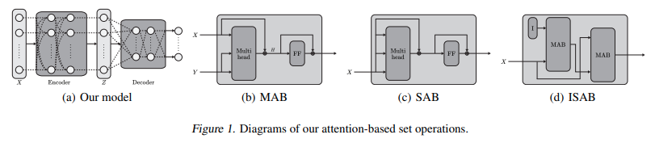

</img>

## Induced Set Attention Block (ISAB) - Pytorch

A concise implementation of (Induced) Set Attention Block, from the Set Transformers paper. It proposes to reduce attention from O(n²) to O(mn), where m is the number of inducing points (learned queries).

## Install

```bash
$ pip install isab-pytorch
```

## Usage

You can either set the number of induced points, in which the parameters will be instantiated and returned on completion of cross attention.

```python
import torch
from isab_pytorch import ISAB

attn = ISAB(
    dim = 512,
    heads = 8,
    num_induced_points = 128
)

x = torch.randn(1, 1024, 512)
m = torch.ones((1, 1024)).bool()

out, induced_points = attn(x, mask = m) # (1, 1024, 512), (1, 128, 512)
```

Or you can not set the number of induced points, where you can pass in the induced points yourself (some global memory that propagates down the transformer, as an example)

```python
import torch
from torch import nn
from isab_pytorch import ISAB

attn = ISAB(
    dim = 512,
    heads = 8
)

mem = nn.Parameter(torch.randn(128, 512)) # some memory, passed through multiple ISABs
x = torch.randn(1, 1024, 512)

out, mem_updated = attn(x, mem) # (1, 1024, 512), (1, 128, 512)
```

## Citations

```bibtex
@misc{lee2019set,
    title={Set Transformer: A Framework for Attention-based Permutation-Invariant Neural Networks}, 
    author={Juho Lee and Yoonho Lee and Jungtaek Kim and Adam R. Kosiorek and Seungjin Choi and Yee Whye Teh},
    year={2019},
    eprint={1810.00825},
    archivePrefix={arXiv},
    primaryClass={cs.LG}
}
```
