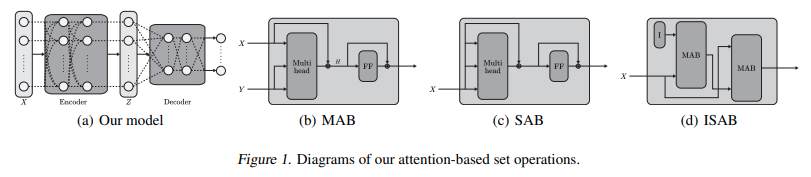

</img>

## Induced Set Attention Block (ISAB) - Pytorch

A concise implementation of (Induced) Set Attention Block, from the Set Transformers paper. It proposes to reduce attention from O(n²) to O(mn), where m is the number of inducing points (learned latents).

Update: Interesting enough, <a href="https://arxiv.org/abs/2212.11972">a new paper</a> has used the ISAB block successfully, in the domain of denoising diffusion for efficient generation of images and video.

## Install

```bash
$ pip install isab-pytorch
```

## Usage

You can either set the number of latents, in which the parameters will be instantiated and returned on completion of cross attention.

```python
import torch
from isab_pytorch import ISAB

attn = ISAB(
    dim = 512,
    heads = 8,
    num_latents = 128,
    latent_self_attend = True
)

seq = torch.randn(1, 16384, 512) # (batch, seq, dim)
mask = torch.ones((1, 16384)).bool()

out, latents = attn(seq, mask = mask) # (1, 16384, 512), (1, 128, 512)
```

Or you can choose not to set the number of latents, and pass in the latents yourself (some persistent latent that propagates down the transformer, as an example)

```python
import torch
from isab_pytorch import ISAB

attn = ISAB(
    dim = 512,
    heads = 8
)

seq = torch.randn(1, 16384, 512) # (batch, seq, dim)
latents = torch.nn.Parameter(torch.randn(128, 512)) # some memory, passed through multiple ISABs

out, new_latents = attn(seq, latents) # (1, 16384, 512), (1, 128, 512)
```

Inverted attention can be enabled with `inverted_attention = True`. In this mode, softmax is applied over the query dimension instead of the key dimension, allowing latents to compete for input tokens — as in the slot attention literature.

```python
import torch
from isab_pytorch import ISAB

attn = ISAB(
    dim = 512,
    heads = 8,
    num_latents = 128,
    inverted_attention = True
)

seq = torch.randn(1, 16384, 512)
mask = torch.ones((1, 16384)).bool()

out, latents = attn(seq, mask = mask) # (1, 16384, 512), (1, 128, 512)
```

## Citations

```bibtex
@misc{lee2019set,
    title   = {Set Transformer: A Framework for Attention-based Permutation-Invariant Neural Networks},
    author  = {Juho Lee and Yoonho Lee and Jungtaek Kim and Adam R. Kosiorek and Seungjin Choi and Yee Whye Teh},
    year    = {2019},
    eprint  = {1810.00825},
    archivePrefix = {arXiv},
    primaryClass = {cs.LG}
}
```

```bibtex
@article{Alayrac2022Flamingo,
    title   = {Flamingo: a Visual Language Model for Few-Shot Learning},
    author  = {Jean-Baptiste Alayrac et al},
    year    = {2022}
}
```

```bibtex
@inproceedings{Locatello2020SlotAttention,
    title     = {Object-Centric Learning with Slot Attention},
    author    = {Francesco Locatello and Dirk Weissenborn and Thomas Unterthiner and Aravindh Mahendran and Georg Heigold and Jakob Uszkoreit and Alexey Dosovitskiy and Thomas Kipf},
    booktitle = {NeurIPS},
    year      = {2020}
}
```

```bibtex
@inproceedings{Luo2025InvertedAttention,
    title     = {Inverted Attention},
    author    = {Hanzhe Liang and Xinle Lyu and Jingze Shi and Hao Zhou and Changjian Li and Bo Dai and Jianbing Shen and Shuicheng Yan and Jiashi Feng and Zhenguo Li and Dit-Yan Yeung and Kwan-Yee K. Wong and Wanli Ouyang and Haian Luo},
    booktitle = {ICLR},
    year      = {2025}
}
```
